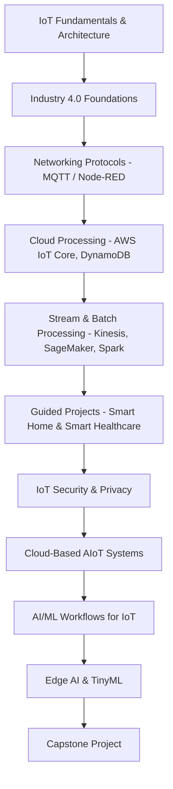
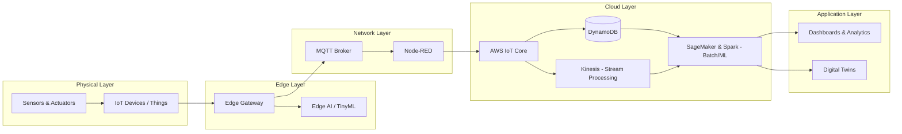
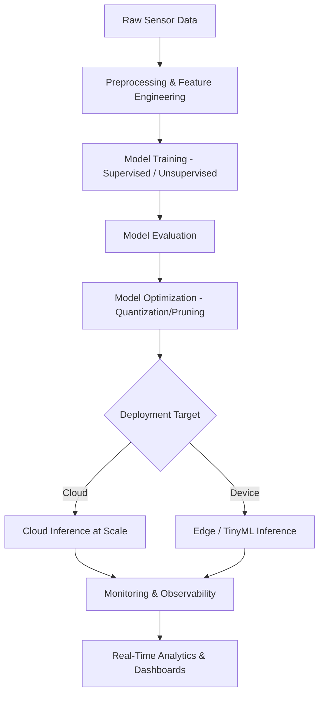
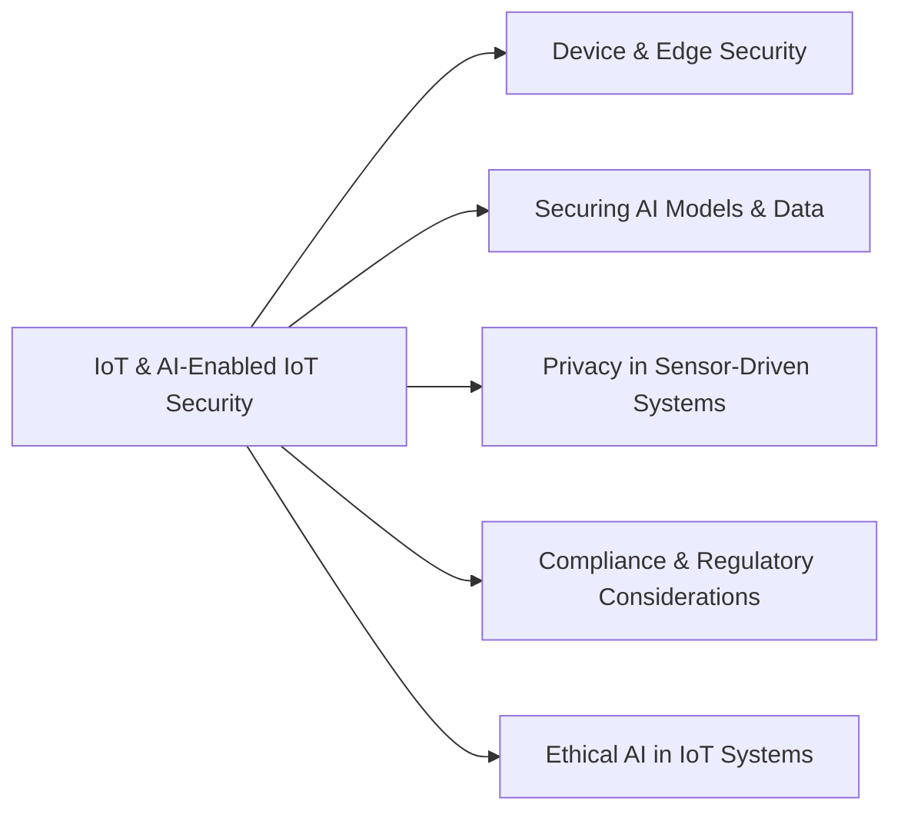

# IoT for Industry 4.0: Cloud, Edge AI & Smart Systems

> **18 sections • 108 lectures • 21h 17m total length**

A comprehensive course covering IoT fundamentals, Industry 4.0, cloud & edge processing, AI/ML for IoT, Edge AI/TinyML, and IoT security — through lectures, hands-on labs, guided projects, and a capstone project.

---

## 📌 Course Journey Overview

---

## 🧩 Section-Level Course Content

| # | Section | Lectures | Duration |
|---|---------|----------|----------|
| 1 | IoT for Industry 4.0 – Course Outline & Getting Started | 3 | 14 min |
| 2 | IoT Fundamentals, Architecture & Challenges | 12 | 2h 6min |
| 3 | Introduction to Industry 4.0 | 5 | 1h 23min |
| 4 | Hands-on Lab – MQTT Communication | 6 | 54 min |
| 5 | Hands-On AIoT Pipeline in Python | 7 | 52 min |
| 6 | IoT Devices, Cloud and Edge Computing | 7 | 1h 30min |
| 7 | IoT Networking Protocol and Application | 8 | 2h 12min |
| 8 | IoT Cloud Processing with AWS IoT Core & DynamoDB | 4 | 1h 13min |
| 9 | IoT Cloud Stream Processing – AWS IoT Core, Kinesis, DynamoDB | 4 | 1h 3min |
| 10 | IoT Cloud Batch Processing – AWS SageMaker & Spark | 2 | 39 min |
| 11 | Connecting Dots (Guided Projects) | 5 | 1h 30min |
| 12 | Capstone Project | 2 | 12 min |
| 13 | Cybersecurity in IoT and AI-enabled IoT Systems | 6 | 58 min |
| 14 | Cloud-Based AIoT Systems | 10 | 1h 21min |
| 15 | AI-ML Workflows for IoT | 12 | 2h 22min |
| 16 | AI and Machine Learning for AIoT – Hands-on Lab | 7 | 1h 13min |
| 17 | Edge AI and TinyML | 6 | 1h 20min |
| 18 | Edge AI and TinyML – Hands-On | 2 | 16 min |

---

## 🏗️ IoT Layered Architecture (as covered in the course)

---

## 🤖 AI/ML & Edge AI Pipeline (as covered in the course)

---

## 🔐 IoT Security Considerations Covered

---

## 🎯 Projects Included

- **Guided Project 1:** Smart Home – Problem Statement, Solution Approach & Implementation
- **Guided Project 2:** Smart Healthcare – Problem Statement, Solution Approach & Implementation
- **Capstone Project:** End-to-end AIoT solution design and implementation
